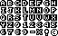
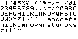
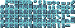

# Fonts from sprites in python
Goal is pretty straightforward. Take font texsture, parse letters and stick them in one canvas to make text. Probably will support formatting as well later.

# Abstract

The main point is to create easy tool to convert character maps directly into text as images which could be used elswhere. Of course they are normally meant to be used in applications like games and such, but sometimes one need to just write something in fancy font.

# Different font charmaps

Problem which will occur with every charmap is lack of format or pixel standard, so main focus lies in creating easy interface that will do most things for us. Here are some example character maps:

